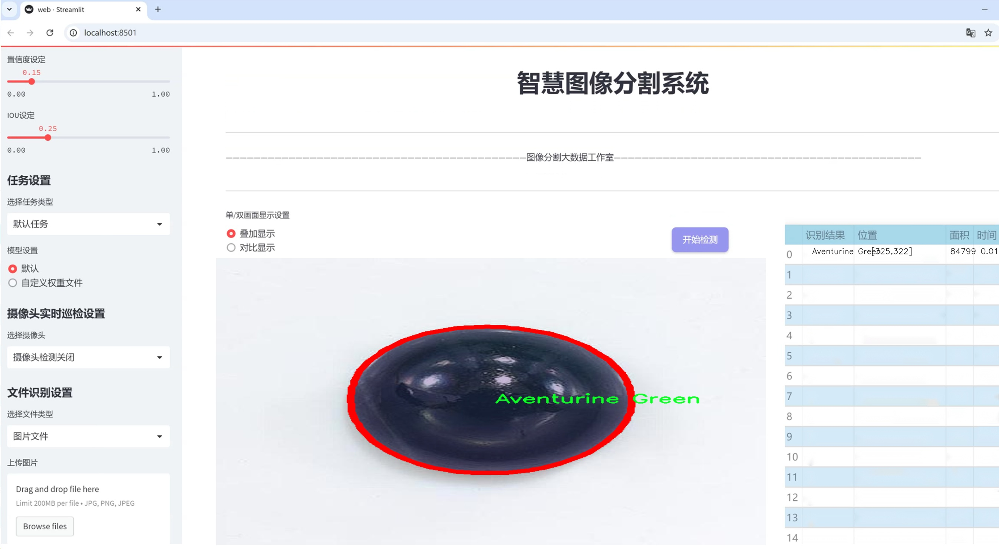

# 宝石图像分割系统源码＆数据集分享
 [yolov8-seg-KernelWarehouse＆yolov8-seg-RevCol等50+全套改进创新点发刊_一键训练教程_Web前端展示]

### 1.研究背景与意义

项目参考[ILSVRC ImageNet Large Scale Visual Recognition Challenge](https://gitee.com/YOLOv8_YOLOv11_Segmentation_Studio/projects)

项目来源[AAAI Global Al lnnovation Contest](https://kdocs.cn/l/cszuIiCKVNis)

研究背景与意义

随着科技的不断进步，计算机视觉技术在各个领域的应用日益广泛，尤其是在图像处理和物体识别方面。近年来，深度学习技术的迅猛发展为图像分割任务提供了新的解决方案，其中YOLO（You Only Look Once）系列模型因其高效性和准确性受到广泛关注。YOLOv8作为该系列的最新版本，进一步提升了实时目标检测和分割的能力。然而，针对特定领域的图像分割任务，尤其是宝石图像的分割，仍然面临诸多挑战。

宝石作为一种具有高经济价值和美学价值的自然资源，其分类和鉴定一直是珠宝行业的重要任务。传统的宝石识别方法多依赖于人工经验和手工操作，效率低下且容易受到主观因素的影响。随着宝石种类的多样化，如何快速、准确地对宝石进行分类和分割，成为了亟待解决的问题。基于改进YOLOv8的宝石图像分割系统，旨在通过深度学习技术实现对宝石图像的高效处理，进而提升宝石识别的准确性和效率。

本研究使用的数据集包含3200张宝石图像，涵盖86种不同类别的宝石，包括但不限于钻石、红宝石、蓝宝石、翡翠等。这一丰富的数据集为模型的训练和测试提供了坚实的基础。通过对这些宝石图像进行实例分割，不仅可以实现对每一颗宝石的精准定位，还能够为后续的特征提取和分类提供重要支持。此外，宝石图像的多样性和复杂性也为模型的泛化能力提出了更高的要求，进一步推动了深度学习技术在特定领域的应用研究。

本研究的意义在于，首先，通过改进YOLOv8模型，可以显著提高宝石图像分割的准确性和效率，进而为珠宝行业提供一种自动化的解决方案，减少人工干预，降低人为错误的风险。其次，研究成果将为宝石图像处理领域的相关研究提供新的思路和方法，推动计算机视觉技术在珠宝鉴定中的应用发展。最后，随着模型的不断优化和数据集的扩展，未来有望实现更为广泛的宝石种类识别，为珠宝行业的数字化转型提供强有力的技术支持。

综上所述，基于改进YOLOv8的宝石图像分割系统不仅具有重要的学术价值，还具备广泛的应用前景。通过本研究的深入开展，期望能够为宝石行业带来技术革新，推动其向智能化、自动化的方向发展，为消费者提供更为优质的服务。

### 2.图片演示




##### 注意：由于此博客编辑较早，上面“2.图片演示”和“3.视频演示”展示的系统图片或者视频可能为老版本，新版本在老版本的基础上升级如下：（实际效果以升级的新版本为准）

  （1）适配了YOLOV8的“目标检测”模型和“实例分割”模型，通过加载相应的权重（.pt）文件即可自适应加载模型。

  （2）支持“图片识别”、“视频识别”、“摄像头实时识别”三种识别模式。

  （3）支持“图片识别”、“视频识别”、“摄像头实时识别”三种识别结果保存导出，解决手动导出（容易卡顿出现爆内存）存在的问题，识别完自动保存结果并导出到tempDir中。

  （4）支持Web前端系统中的标题、背景图等自定义修改，后面提供修改教程。

  另外本项目提供训练的数据集和训练教程,暂不提供权重文件（best.pt）,需要您按照教程进行训练后实现图片演示和Web前端界面演示的效果。

### 3.视频演示

[3.1 视频演示](https://www.bilibili.com/video/BV1fex9ezEfw/)

### 4.数据集信息展示

##### 4.1 本项目数据集详细数据（类别数＆类别名）

nc: 86
names: ['Alexandrite', 'Almandine', 'Amazonite', 'Amber', 'Amethyst', 'Ametrine', 'Andalusite', 'Andradite', 'Aquamarine', 'Aventurine Green', 'Aventurine Yellow', 'Benitoite', 'Bixbite', 'Bloodstone', 'Blue Lace Agate', 'Brely Golden', 'Carnelian', 'Cats Eye', 'Chalcedony Blue', 'Chrome Diopside', 'Chrysoberyl', 'Chrysocolla', 'Chrysoprase', 'Citrine', 'Coral', 'Danburite', 'Diamond', 'Diaspore', 'Dumortierite', 'Emerald', 'Fluorite', 'Garnet Red', 'Goshenite', 'Grossular', 'Hessonite', 'Hiddenite', 'Iolite', 'Jade', 'Jasper', 'Kunzite', 'Kyanite', 'Labradorite', 'Lapis Lazuli', 'Larimar', 'Malachite', 'Moonstone', 'Morganite', 'Onyx Black', 'Onyx Green', 'Onyx Red', 'Opal', 'Pearl', 'Peridot', 'Prehinte', 'Pyrite', 'Pyrope', 'Quartz Beer', 'Quartz Lemon', 'Quartz Rose', 'Quartz Rutilated', 'Quartz Smoky', 'Rhodochrosite', 'Rhodolite', 'Rhodonite', 'Ruby', 'Sapphire Blue', 'Sapphire Pink', 'Sapphire Purple', 'Sapphire Yellow', 'Scapolite', 'Serpentine', 'Sodalite', 'Spessartite', 'Sphene', 'Spinel', 'Spodumene', 'Sunstone', 'Tanzanite', 'Tigers Eye', 'Topaz', 'Tourmaline', 'Tsavorite', 'Turquoise', 'Variscite', 'Zircon', 'Zoisite']


##### 4.2 本项目数据集信息介绍

数据集信息展示

在本研究中，我们使用了名为“Gem Stones”的数据集，以训练和改进YOLOv8-seg模型，旨在实现高效的宝石图像分割系统。该数据集包含了86个不同类别的宝石，每个类别代表了一种独特的宝石类型，涵盖了从常见到稀有的多种宝石。这些宝石不仅在外观上各具特色，而且在市场价值、物理特性和文化意义上也有着显著的差异。因此，构建一个高效的图像分割系统，对于宝石的识别、分类和后续的应用具有重要的现实意义。

数据集中包含的类别名称从“Alexandrite”到“Zoisite”，每一种宝石都具有其独特的颜色、形状和纹理特征。例如，“Diamond”以其无与伦比的光泽和硬度而闻名，而“Emerald”则因其鲜艳的绿色而受到青睐。“Amethyst”作为一种紫色的水晶，常常被用于制作珠宝，而“Opal”则以其多彩的光泽和独特的色彩变化而受到收藏家的喜爱。此外，数据集中还包括一些较为冷门的宝石，如“Benitoite”和“Tsavorite”，这些宝石的稀有性使得它们在市场上更具吸引力。

为了确保模型的训练效果，数据集中的每个类别都包含了大量的图像样本。这些图像不仅涵盖了不同的拍摄角度和光照条件，还展示了宝石在不同背景下的表现。这种多样性使得模型能够学习到更加丰富的特征，从而提高其在实际应用中的鲁棒性和准确性。在数据集的构建过程中，图像的标注工作至关重要，确保每个宝石的边界和特征被准确地标识出来，以便于模型进行有效的学习。

在进行YOLOv8-seg模型的训练时，我们将利用该数据集中的丰富信息，针对每种宝石的特征进行深度学习。通过对宝石图像的分割，模型将能够识别出宝石的轮廓和细节，从而实现更为精准的分类和识别。这一过程不仅提高了宝石识别的效率，也为后续的自动化处理提供了可能的解决方案。

总之，“Gem Stones”数据集为我们提供了一个丰富的宝石图像库，涵盖了多达86种不同类型的宝石，具有广泛的应用潜力。通过利用这一数据集，我们的目标是开发出一个高效、准确的宝石图像分割系统，推动宝石行业的智能化发展。随着技术的不断进步，我们期待这一系统能够在宝石鉴定、市场分析和个性化推荐等领域发挥重要作用，为消费者和行业专业人士提供更为便捷的服务。


### 5.全套项目环境部署视频教程（零基础手把手教学）

[5.1 环境部署教程链接（零基础手把手教学）](https://www.bilibili.com/video/BV1jG4Ve4E9t/?vd_source=bc9aec86d164b67a7004b996143742dc)


[5.2 安装Python虚拟环境创建和依赖库安装视频教程链接（零基础手把手教学）](https://www.bilibili.com/video/BV1nA4VeYEze/?vd_source=bc9aec86d164b67a7004b996143742dc)

### 6.手把手YOLOV8-seg训练视频教程（零基础小白有手就能学会）

[6.1 手把手YOLOV8-seg训练视频教程（零基础小白有手就能学会）](https://www.bilibili.com/video/BV1cA4VeYETe/?vd_source=bc9aec86d164b67a7004b996143742dc)


按照上面的训练视频教程链接加载项目提供的数据集，运行train.py即可开始训练



     Epoch   gpu_mem       box       obj       cls    labels  img_size
     1/200     0G   0.01576   0.01955  0.007536        22      1280: 100%|██████████| 849/849 [14:42<00:00,  1.04s/it]
               Class     Images     Labels          P          R     mAP@.5 mAP@.5:.95: 100%|██████████| 213/213 [01:14<00:00,  2.87it/s]
                 all       3395      17314      0.994      0.957      0.0957      0.0843

     Epoch   gpu_mem       box       obj       cls    labels  img_size
     2/200     0G   0.01578   0.01923  0.007006        22      1280: 100%|██████████| 849/849 [14:44<00:00,  1.04s/it]
               Class     Images     Labels          P          R     mAP@.5 mAP@.5:.95: 100%|██████████| 213/213 [01:12<00:00,  2.95it/s]
                 all       3395      17314      0.996      0.956      0.0957      0.0845

     Epoch   gpu_mem       box       obj       cls    labels  img_size
     3/200     0G   0.01561    0.0191  0.006895        27      1280: 100%|██████████| 849/849 [10:56<00:00,  1.29it/s]
               Class     Images     Labels          P          R     mAP@.5 mAP@.5:.95: 100%|███████   | 187/213 [00:52<00:00,  4.04it/s]
                 all       3395      17314      0.996      0.957      0.0957      0.0845


### 7.50+种全套YOLOV8-seg创新点代码加载调参视频教程（一键加载写好的改进模型的配置文件）

[7.1 50+种全套YOLOV8-seg创新点代码加载调参视频教程（一键加载写好的改进模型的配置文件）](https://www.bilibili.com/video/BV1Hw4VePEXv/?vd_source=bc9aec86d164b67a7004b996143742dc)

### 8.YOLOV8-seg图像分割算法原理

原始YOLOv8-seg算法原理

YOLOv8-seg算法是YOLO系列中的最新进展，旨在提升目标检测与分割的精度与效率。相较于前代模型，YOLOv8-seg在结构设计、特征提取及损失计算等方面进行了多项创新，使其在各种应用场景中表现出色。该算法的核心思想是通过改进的网络架构与高效的训练策略，优化目标检测与分割的性能。

YOLOv8-seg的网络结构可以分为四个主要部分：输入端、骨干网络、颈部网络和头部网络。输入端负责数据预处理，包括马赛克增强、自适应锚框计算和自适应灰度填充等技术，以提升模型的鲁棒性和泛化能力。马赛克增强通过将多张图像拼接在一起，增加了训练样本的多样性，帮助模型更好地学习不同场景下的特征。而自适应锚框计算则通过动态调整锚框的尺寸与比例，确保模型能够更准确地检测到不同大小的目标。

在骨干网络部分，YOLOv8-seg采用了C2f模块和SPPF结构。C2f模块的设计灵感来源于YOLOv7的ELAN结构，通过引入更多的分支连接，增强了梯度流动性，使得模型在训练过程中能够更有效地学习到丰富的特征表示。SPPF模块则通过空间金字塔池化的方式，处理多尺度特征，进一步提升了网络的特征抽象能力。这种结构的改进，使得YOLOv8-seg在处理复杂场景时，能够更好地捕捉到目标的细节信息。

颈部网络采用了路径聚合网络（PAN）结构，旨在加强不同尺度特征的融合能力。PAN结构通过自底向上的特征融合方式，将低层次的细节信息与高层次的语义信息结合起来，从而提高了模型对多尺度目标的检测能力。这一设计使得YOLOv8-seg在面对复杂背景或小目标时，依然能够保持较高的检测精度。

头部网络是YOLOv8-seg的关键部分，其采用了解耦的检测头结构。与传统的耦合头不同，解耦头将分类与定位任务分开处理，分别通过两条并行的卷积分支进行特征提取与损失计算。这种设计不仅提高了模型的灵活性，还减少了计算复杂度，使得YOLOv8-seg在进行目标检测与分割时，能够更高效地处理信息。分类分支使用二元交叉熵损失，而回归分支则结合了分布焦点损失与完全交并比损失函数，以提升边界框预测的准确性。

在标签分配策略方面，YOLOv8-seg引入了动态标签分配机制，解决了传统方法中存在的正负样本匹配问题。通过使用TOOD策略，YOLOv8-seg能够在训练过程中动态调整正负样本的分配，确保模型在学习过程中能够关注到高质量的样本。这一策略有效地提升了模型的学习效率，使得YOLOv8-seg在处理复杂场景时，能够更快地收敛并提高精度。

此外，YOLOv8-seg在损失计算方面也进行了创新。其分类损失采用了变焦损失（Varifocal Loss），通过对正负样本进行加权，提升了模型对高质量样本的关注度。对于负样本，YOLOv8-seg通过对预测得分进行衰减，降低了负样本对整体损失的影响，从而使得模型在训练过程中更加专注于高质量的正样本。这种设计使得YOLOv8-seg在实际应用中，能够更好地适应不同场景的需求。

综上所述，YOLOv8-seg算法通过对网络结构的深度优化、特征提取的精细化处理以及损失计算的创新设计，显著提升了目标检测与分割的性能。其在实际应用中的高效性与准确性，使得YOLOv8-seg成为了计算机视觉领域中一个重要的里程碑。随着技术的不断进步，YOLOv8-seg将为更多的智能应用提供强大的支持，推动目标检测与分割技术的进一步发展。


### 9.系统功能展示（检测对象为举例，实际内容以本项目数据集为准）

图9.1.系统支持检测结果表格显示

  图9.2.系统支持置信度和IOU阈值手动调节

  图9.3.系统支持自定义加载权重文件best.pt(需要你通过步骤5中训练获得)

  图9.4.系统支持摄像头实时识别

  图9.5.系统支持图片识别

  图9.6.系统支持视频识别

  图9.7.系统支持识别结果文件自动保存

  图9.8.系统支持Excel导出检测结果数据


### 10.50+种全套YOLOV8-seg创新点原理讲解（非科班也可以轻松写刊发刊，V11版本正在科研待更新）

#### 10.1 由于篇幅限制，每个创新点的具体原理讲解就不一一展开，具体见下列网址中的创新点对应子项目的技术原理博客网址【Blog】：


[10.1 50+种全套YOLOV8-seg创新点原理讲解链接](https://gitee.com/qunmasj/good)

#### 10.2 部分改进模块原理讲解(完整的改进原理见上图和技术博客链接)
### YOLOv8简介
YOLOv8目标检测算法继承了YOLOv1系列的思考,是一种新型端到端的目标检测算法,尽管现在原始检测算法已经开源,但是鲜有发表的相关论文.YOLOv8的网络结构如图所示,主要可分为Input输入端、Backbone骨干神经网络、Neck 混合特征网络层和Head预测层网络共4个部分.

YOLO目标检测算法是一种端到端的One-Slage 目标检测算法，其核心思想是将图像按区域分块进行预测。YOLO将输入图像按照32x32的大小划分成若干个网格，例如416x416的图像将被划分为13x13个网格。当目标物体的中心位于某个网格内时,该网格就会负责输出该物体的边界框和类别置信度。每个网格可以预测多个边界框和多个目标类别,这些边界框和类别的数量可以根据需要进行设置。YOLO算法的输出是一个特征图,包含了每个网格对应的边界框和类别置信度的信息呵。本文采用YOLO最新的YOLOv8模型，其是2022年底发布的最新YOLO系列模型，采用全新的SOTA模型，全新的网络主干结构,如图1所示。
整个网络分为Backbone 骨干网络部分和Head头部网络部分。YOLOv8汲取了前几代网络的优秀特性，骨干网络和 Neck部分遵循CSP的思想，将YOLOv5中的C3模块被替换成了梯度流更丰富C2模块,去掉YOLOv5中 PAN-FPN上采样阶段中的卷积结构,将Backbone不同阶段输出的特征直接送入了上采样操作,模型提供了N/S/M/L/X尺度的不同大小模型,能够满足不同领域业界的需求。本文基于YOLOv8模型设计番茄病虫害检测系统，通过配置模型参数训练番茄图像,得到能够用于部署应用的最优模型。


### 感受野注意力卷积（RFAConv)
#### 标准卷积操作回顾
标准的卷积操作是构造卷积神经网络的基本构件。它利用具有共享参数的滑动窗口提取特征信息，克服了全连通层构造神经网络固有的参数多、计算开销大的问题。设 X R∈C×H×W
表示输入特征图，其中C、H、W分别表示特征图的通道数、高度、宽度。为了清楚地演示卷积核的特征提取过程，我们使用 C = 1 的例子。从每个接受域滑块中提取特征信息的卷积运算可以表示为:


这里，Fi 表示计算后每个卷积滑块得到的值，Xi 表示每个滑块内对应位置的像素值，K表示卷积核，S表示卷积核中的参数个数，N表示接收域滑块的总数。可以看出，每个滑块内相同位置的 feature共享相同的参数Ki。因此，标准的卷积运算并不能捕捉到不同位置所带来的信息差异，这最终在一定程度上限制了卷积神经网络的性能。 

#### 空间注意力回顾
目前，空间注意机制是利用学习得到的注意图来突出每个特征的重要性。与前一节类似，这里以 C=1为例。突出关键特征的空间注意机制可以简单表述为:这里，Fi 表示加权运算后得到的值。xi 和Ai 表示输入特征图和学习到的注意图在不同位置的值，N为输入特征图的高和宽的乘积，表示像素值的总数。


#### 空间注意与标准卷积运算
将注意力机制整合到卷积神经网络中，可以提高卷积神经网络的性能。通过对标准卷积运算和现有空间注意机制的研究，我们认为空间注意机制有效地克服了卷积神经网络固有的参数共享的局限性。目前卷积神经网络中最常用的核大小是 1 × 1和3 × 3。在引入空间注意机制后，提取特征的卷积操作可以是 1 × 1或3 × 3卷积操作。为了直观地展示这个过程，在 1 × 1卷积运算的前面插入了空间注意机制。通过注意图对输入特征图(Re-weight“×”)进行加权运算，最后通过 1 × 1卷积运算提取接收域的滑块特征信息。整个过程可以简单地表示如下:


 这里卷积核K仅代表一个参数值。如果取A i× ki 的值作为一种新的卷积核参数，有趣的是它解决了 1×1卷积运算提取特征时的参数共享问题。然而，关于空间注意机制的传说到此结束。当空间注意机制被插入到3×3卷积运算前面时。具体情况如下:


如上所述，如果取A的值 i × ki (4)式作为一种新的卷积核参数，完全解决了大规模卷积核的参数共享问题。然而，最重要的一点是，卷积核在提取每个接受域滑块的特征时，会共享一些特征。换句话说，每个接收域滑块内都有一个重叠。仔细分析后会发现A12= a21， a13 = a22， a15 = a24……，在这种情况下，每个滑动窗口共享空间注意力地图的权重。因此，空间注意机制没有考虑整个接受域的空间特征，不能有效地解决大规模卷积核的参数共享问题。因此，空间注意机制的有效性受到限制。 

#### 创新空间注意力和标准卷积操作
该博客提出解决了现有空间注意机制的局限性，为空间处理提供了一种创新的解决方案。受RFA的启发，一系列空间注意机制被开发出来，可以进一步提高卷积神经网络的性能。RFA可以看作是一个轻量级即插即用模块，RFA设计的卷积运算(RFAConv)可以代替标准卷积来提高卷积神经网络的性能。因此，我们预测空间注意机制与标准卷积运算的结合将继续发展，并在未来带来新的突破。
接受域空间特征:为了更好地理解接受域空间特征的概念，我们将提供相关的定义。接收域空间特征是专门为卷积核设计的，并根据核大小动态生成。如图1所示，以3×3卷积核为例。在图1中，“Spatial Feature”指的是原始的Feature map。“接受域空间特征”是空间特征变换后的特征图。

 

由不重叠的滑动窗口组成。当使用 3×3卷积内核提取特征时，接收域空间特征中的每个 3×3大小窗口代表一个接收域滑块。接受域注意卷积(RFAConv):针对接受域的空间特征，我们提出了接受域注意卷积(RFA)。该方法不仅强调了接收域滑块内不同特征的重要性，而且对接收域空间特征进行了优先排序。通过该方法，完全解决了卷积核参数共享的问题。接受域空间特征是根据卷积核的大小动态生成的，因此，RFA是卷积的固定组合，不能与卷积操作的帮助分离，卷积操作同时依赖于RFA来提高性能，因此我们提出了接受场注意卷积(RFAConv)。具有3×3大小的卷积核的RFAConv整体结构如图所示。


目前，最广泛使用的接受域特征提取方法是缓慢的。经过大量的研究，我们开发了一种快速的方法，用分组卷积来代替原来的方法。具体来说，我们利用相应大小的分组卷积来动态生成基于接受域大小的展开特征。尽管与原始的无参数方法(如PyTorch提供的nn.())相比，该方法增加了一些参数，但它的速度要快得多。注意:如前一节所述，当使用 3×3卷积内核提取特征时，接收域空间特征中的每个 3×3大小窗口表示一个接收域滑块。而利用快速分组卷积提取感受野特征后，将原始特征映射为新的特征。最近的研究表明。交互信息可以提高网络性能，如[40,41,42]所示。同样，对于RFAConv来说，通过交互接受域特征信息来学习注意图可以提高网络性能。然而，与每个接收域特征交互会导致额外的计算开销，因此为了最小化计算开销和参数的数量，我们使用AvgPool来聚合每个接收域特征的全局信息。然后，使用 1×1 组卷积操作进行信息交互。最后，我们使用softmax来强调每个特征在接受域特征中的重要性。一般情况下，RFA的计算可以表示为:


这里gi×i 表示一个大小为 i×i的分组卷积，k表示卷积核的大小，Norm表示归一化，X表示输入的特征图，F由注意图 a相乘得到 rf 与转换后的接受域空间特征 Frf。与CBAM和CA不同，RFA能够为每个接受域特征生成注意图。卷积神经网络的性能受到标准卷积操作的限制，因为卷积操作依赖于共享参数，对位置变化带来的信息差异不敏感。然而，RFAConv通过强调接收域滑块中不同特征的重要性，并对接收域空间特征进行优先级排序，可以完全解决这个问题。通过RFA得到的feature map是接受域空间特征，在“Adjust Shape”后没有重叠。因此，学习到的注意图将每个接受域滑块的特征信息聚合起来。换句话说，注意力地图不再共享在每个接受域滑块。这完全弥补了现有 CA和CBAM注意机制的不足。RFA为标准卷积内核提供了显著的好处。而在调整形状后，特征的高度和宽度是 k倍，需要进行 stride = k的k × k卷积运算来提取特征信息。RFA设计的卷积运算RFAConv为卷积带来了良好的增益，对标准卷积进行了创新。
此外，我们认为现有的空间注意机制应该优先考虑接受域空间特征，以提高网络性能。众所周知，基于自注意机制的网络模型[43,44,45]取得了很大的成功，因为它解决了卷积参数共享的问题，并对远程信息进行建模。然而，自注意机制也为模型引入了显著的计算开销和复杂性。我们认为，将现有的空间注意机制的注意力引导到接受场空间特征上，可以以类似于自我注意的方式解决长期信息的参数共享和建模问题。与自我关注相比，这种方法需要的参数和计算资源少得多。答案如下:(1)将以接收场空间特征为中心的空间注意机制与卷积相结合，消除了卷积参数共享的问题。(2)现有的空间注意机制已经考虑了远程信息，可以通过全局平均池或全局最大池的方式获取全局信息，其中明确考虑了远程信息。因此，我们设计了新的 CBAM和CA模型，称为RFCBAM和RFCA，它们专注于接受域空间特征。与RFA类似，使用最终的k × k stride = k 的卷积运算来提取特征信息。这两种新的卷积方法的具体结构如图 3所示，我们称这两种新的卷积操作为 RFCBAMConv和RFCAConv。与原来的CBAM相比，我们在RFCBAM中使用SE attention来代替CAM。因为这样可以减少计算开销。此外，在RFCBAM中，通道注意和空间注意不是分开执行的。相反，它们是同时加权的，使得每个通道获得的注意力地图是不同的。


### 11.项目核心源码讲解（再也不用担心看不懂代码逻辑）

#### 11.1 ultralytics\utils\downloads.py

以下是经过简化和注释的核心代码部分，主要保留了文件下载、解压、检查磁盘空间等功能。代码中添加了详细的中文注释以帮助理解。

```python
import contextlib
import shutil
import subprocess
from pathlib import Path
import requests
from zipfile import ZipFile, is_zipfile
from ultralytics.utils import LOGGER, TQDM

def check_disk_space(url='https://ultralytics.com/assets/coco128.zip', sf=1.5, hard=True):
    """
    检查下载文件所需的磁盘空间是否足够。

    Args:
        url (str): 文件的URL，默认为 'https://ultralytics.com/assets/coco128.zip'。
        sf (float): 安全因子，所需空间的倍数，默认为1.5。
        hard (bool): 是否在磁盘空间不足时抛出错误，默认为True。

    Returns:
        bool: 如果有足够的磁盘空间则返回True，否则返回False。
    """
    try:
        r = requests.head(url)  # 发送HEAD请求获取文件信息
        assert r.status_code < 400, f'URL error for {url}: {r.status_code} {r.reason}'  # 检查响应状态
    except Exception:
        return True  # 请求出错时默认返回True

    # 获取文件大小
    data = int(r.headers.get('Content-Length', 0)) / (1 << 30)  # 文件大小（GB）
    total, used, free = (x / (1 << 30) for x in shutil.disk_usage('/'))  # 获取磁盘使用情况
    if data * sf < free:
        return True  # 有足够空间

    # 空间不足
    text = (f'WARNING ⚠️ 磁盘空间不足 {free:.1f} GB < {data * sf:.3f} GB 所需，'
            f'请释放 {data * sf - free:.1f} GB 的额外磁盘空间后重试。')
    if hard:
        raise MemoryError(text)
    LOGGER.warning(text)
    return False

def safe_download(url, file=None, dir=None, unzip=True, delete=False, retry=3, progress=True):
    """
    从URL下载文件，并可选择解压和删除下载的文件。

    Args:
        url (str): 要下载的文件的URL。
        file (str, optional): 下载文件的文件名。如果未提供，将使用URL中的文件名。
        dir (str, optional): 保存下载文件的目录。如果未提供，将保存在当前工作目录中。
        unzip (bool, optional): 是否解压下载的文件，默认为True。
        delete (bool, optional): 是否在解压后删除下载的文件，默认为False。
        retry (int, optional): 下载失败时的重试次数，默认为3。
        progress (bool, optional): 是否在下载时显示进度条，默认为True。
    """
    f = Path(dir) / (file if file else url.split('/')[-1])  # 生成文件路径
    if not f.is_file():  # 如果文件不存在
        LOGGER.info(f"正在下载 {url} 到 '{f}'...")
        f.parent.mkdir(parents=True, exist_ok=True)  # 创建目录
        check_disk_space(url)  # 检查磁盘空间
        for i in range(retry + 1):
            try:
                # 使用requests下载文件
                response = requests.get(url, stream=True)
                response.raise_for_status()  # 检查请求是否成功
                with open(f, 'wb') as f_opened:
                    for chunk in response.iter_content(chunk_size=8192):
                        f_opened.write(chunk)  # 写入文件
                break  # 下载成功，退出循环
            except Exception as e:
                if i >= retry:
                    raise ConnectionError(f'下载失败: {url}') from e
                LOGGER.warning(f'⚠️ 下载失败，正在重试 {i + 1}/{retry} {url}...')

    # 解压文件
    if unzip and f.exists() and f.suffix in ('.zip', '.tar', '.gz'):
        if is_zipfile(f):
            with ZipFile(f) as zipObj:
                zipObj.extractall(f.parent)  # 解压到同一目录
        if delete:
            f.unlink()  # 删除压缩文件

def download(url, dir=Path.cwd(), unzip=True, delete=False, retry=3):
    """下载文件并根据需要解压。"""
    dir = Path(dir)
    dir.mkdir(parents=True, exist_ok=True)  # 创建目录
    safe_download(url=url, dir=dir, unzip=unzip, delete=delete, retry=retry)  # 调用下载函数
```

### 代码说明：
1. **check_disk_space**: 检查是否有足够的磁盘空间来下载文件。
2. **safe_download**: 从指定的URL下载文件，并根据参数决定是否解压和删除文件。
3. **download**: 简化的下载接口，确保目录存在并调用`safe_download`进行下载。

以上代码是整个文件下载和处理的核心部分，包含了必要的功能和注释，便于理解和使用。

该文件 `ultralytics/utils/downloads.py` 是 Ultralytics YOLO 项目的一部分，主要负责处理文件的下载、解压、以及一些与文件管理相关的功能。以下是对该文件的逐步分析和说明。

首先，文件导入了一些必要的库，包括 `contextlib`、`re`、`shutil`、`subprocess`、`ThreadPool`、`Path`、`parse` 和 `request`，以及 `requests` 和 `torch`。这些库提供了处理文件、网络请求、并发操作等功能。

接下来，定义了一些与 GitHub 资源相关的常量，包括 `GITHUB_ASSETS_REPO` 和 `GITHUB_ASSETS_NAMES`，这些常量列出了在 GitHub 上可用的 YOLO 模型文件名。`GITHUB_ASSETS_STEMS` 则提取了这些文件名的基本名称。

`is_url` 函数用于检查给定字符串是否为有效的 URL，并可选地检查该 URL 是否存在。它使用 `urlparse` 来解析 URL，并通过 `request.urlopen` 来验证 URL 的可达性。

`delete_dsstore` 函数用于删除指定目录下的 `.DS_Store` 文件，这些文件是 macOS 系统生成的隐藏文件，可能在不同操作系统之间传输文件时造成问题。

`zip_directory` 函数将指定目录的内容压缩为 ZIP 文件，并可以选择排除某些文件。它会创建一个与目录同名的 ZIP 文件，并支持显示压缩进度。

`unzip_file` 函数用于解压缩 ZIP 文件，支持排除某些文件，并可以选择在目标路径下创建新目录以存放解压后的内容。如果目标路径已存在且不为空，则可以选择跳过解压。

`check_disk_space` 函数检查下载文件所需的磁盘空间是否充足。它会获取文件的大小，并与当前可用的磁盘空间进行比较，如果空间不足则会抛出异常或记录警告。

`get_google_drive_file_info` 函数用于处理 Google Drive 的共享链接，提取直接下载链接和文件名。它会处理下载配额超限的情况，并返回相应的下载链接和文件名。

`safe_download` 函数是文件下载的核心功能，支持从 URL 下载文件，并可以选择解压、删除下载的文件、使用 curl 下载等。它会检查 URL 是否为 Google Drive 链接，并在下载过程中提供进度条。

`get_github_assets` 函数从指定的 GitHub 仓库获取发布版本和资产列表。它会处理 API 请求并返回版本标签和资产名称。

`attempt_download_asset` 函数尝试从 GitHub 下载指定的文件，如果本地不存在该文件，则会从 GitHub 的发布资产中下载。

最后，`download` 函数支持并发下载多个文件，如果线程数大于 1，则使用 `ThreadPool` 进行并发下载；否则，按顺序下载文件。

整体来看，该文件实现了一个完整的文件下载和管理系统，能够处理多种情况，包括从不同来源下载文件、检查磁盘空间、处理 Google Drive 链接等，为 Ultralytics YOLO 项目的使用提供了便利。

#### 11.2 ultralytics\utils\atss.py

以下是经过简化和注释的核心代码部分，主要集中在生成锚框和计算IoU的功能上：

```python
import torch
import torch.nn as nn
import torch.nn.functional as F

def generate_anchors(feats, fpn_strides, grid_cell_size=5.0, grid_cell_offset=0.5, device='cpu', is_eval=False, mode='af'):
    '''根据特征生成锚框。'''
    anchors = []  # 存储锚框
    anchor_points = []  # 存储锚点
    stride_tensor = []  # 存储每个锚框的步幅
    num_anchors_list = []  # 存储每层的锚框数量

    assert feats is not None  # 确保特征不为空

    # 在评估模式下生成锚框
    if is_eval:
        for i, stride in enumerate(fpn_strides):
            _, _, h, w = feats[i].shape  # 获取特征图的高度和宽度
            shift_x = torch.arange(end=w, device=device) + grid_cell_offset  # 计算x方向的偏移
            shift_y = torch.arange(end=h, device=device) + grid_cell_offset  # 计算y方向的偏移
            shift_y, shift_x = torch.meshgrid(shift_y, shift_x, indexing='ij')  # 创建网格
            anchor_point = torch.stack([shift_x, shift_y], axis=-1).to(torch.float)  # 生成锚点

            if mode == 'af':  # anchor-free模式
                anchor_points.append(anchor_point.reshape([-1, 2]))  # 重塑并添加锚点
                stride_tensor.append(torch.full((h * w, 1), stride, dtype=torch.float, device=device))  # 添加步幅
            elif mode == 'ab':  # anchor-based模式
                anchor_points.append(anchor_point.reshape([-1, 2]).repeat(3, 1))  # 重复锚点
                stride_tensor.append(torch.full((h * w, 1), stride, dtype=torch.float, device=device).repeat(3, 1))  # 重复步幅

        anchor_points = torch.cat(anchor_points)  # 合并锚点
        stride_tensor = torch.cat(stride_tensor)  # 合并步幅
        return anchor_points, stride_tensor  # 返回锚点和步幅

    # 在训练模式下生成锚框
    else:
        for i, stride in enumerate(fpn_strides):
            _, _, h, w = feats[i].shape  # 获取特征图的高度和宽度
            cell_half_size = grid_cell_size * stride * 0.5  # 计算锚框的半边大小
            shift_x = (torch.arange(end=w, device=device) + grid_cell_offset) * stride  # 计算x方向的偏移
            shift_y = (torch.arange(end=h, device=device) + grid_cell_offset) * stride  # 计算y方向的偏移
            shift_y, shift_x = torch.meshgrid(shift_y, shift_x, indexing='ij')  # 创建网格

            # 生成锚框
            anchor = torch.stack(
                [
                    shift_x - cell_half_size, shift_y - cell_half_size,
                    shift_x + cell_half_size, shift_y + cell_half_size
                ],
                axis=-1).clone().to(feats[0].dtype)

            anchor_point = torch.stack([shift_x, shift_y], axis=-1).clone().to(feats[0].dtype)  # 生成锚点

            if mode == 'af':  # anchor-free模式
                anchors.append(anchor.reshape([-1, 4]))  # 重塑并添加锚框
                anchor_points.append(anchor_point.reshape([-1, 2]))  # 重塑并添加锚点
            elif mode == 'ab':  # anchor-based模式
                anchors.append(anchor.reshape([-1, 4]).repeat(3, 1))  # 重复锚框
                anchor_points.append(anchor_point.reshape([-1, 2]).repeat(3, 1))  # 重复锚点

            num_anchors_list.append(len(anchors[-1]))  # 记录锚框数量
            stride_tensor.append(torch.full([num_anchors_list[-1], 1], stride, dtype=feats[0].dtype))  # 添加步幅

        anchors = torch.cat(anchors)  # 合并锚框
        anchor_points = torch.cat(anchor_points).to(device)  # 合并锚点并转移到指定设备
        stride_tensor = torch.cat(stride_tensor).to(device)  # 合并步幅并转移到指定设备
        return anchors, anchor_points, num_anchors_list, stride_tensor  # 返回锚框、锚点、锚框数量和步幅

def bbox_overlaps(bboxes1, bboxes2, mode='iou', is_aligned=False, eps=1e-6):
    """计算两个bbox集合之间的重叠情况（如IoU）。"""
    assert mode in ['iou', 'iof', 'giou'], f'不支持的模式 {mode}'  # 确保模式有效
    assert (bboxes1.size(-1) == 4 or bboxes1.size(0) == 0)  # 确保bboxes1的形状有效
    assert (bboxes2.size(-1) == 4 or bboxes2.size(0) == 0)  # 确保bboxes2的形状有效

    # 批次维度必须相同
    assert bboxes1.shape[:-2] == bboxes2.shape[:-2]
    batch_shape = bboxes1.shape[:-2]  # 获取批次形状

    rows = bboxes1.size(-2)  # bboxes1的行数
    cols = bboxes2.size(-2)  # bboxes2的列数
    if is_aligned:
        assert rows == cols  # 如果对齐，行数和列数必须相等

    if rows * cols == 0:  # 如果任一集合为空
        if is_aligned:
            return bboxes1.new(batch_shape + (rows, ))  # 返回空tensor
        else:
            return bboxes1.new(batch_shape + (rows, cols))  # 返回空tensor

    # 计算面积
    area1 = (bboxes1[..., 2] - bboxes1[..., 0]) * (bboxes1[..., 3] - bboxes1[..., 1])
    area2 = (bboxes2[..., 2] - bboxes2[..., 0]) * (bboxes2[..., 3] - bboxes2[..., 1])

    # 计算重叠区域
    if is_aligned:
        lt = torch.max(bboxes1[..., :2], bboxes2[..., :2])  # 左上角
        rb = torch.min(bboxes1[..., 2:], bboxes2[..., 2:])  # 右下角
        wh = (rb - lt).clamp(min=0)  # 宽高
        overlap = wh[..., 0] * wh[..., 1]  # 重叠面积

        if mode in ['iou', 'giou']:
            union = area1 + area2 - overlap  # 计算并集
        else:
            union = area1
    else:
        lt = torch.max(bboxes1[..., :, None, :2], bboxes2[..., None, :, :2])  # 左上角
        rb = torch.min(bboxes1[..., :, None, 2:], bboxes2[..., None, :, 2:])  # 右下角
        wh = (rb - lt).clamp(min=0)  # 宽高
        overlap = wh[..., 0] * wh[..., 1]  # 重叠面积

        if mode in ['iou', 'giou']:
            union = area1[..., None] + area2[..., None, :] - overlap  # 计算并集
        else:
            union = area1[..., None]

    union = union.clamp(min=eps)  # 避免除以零
    ious = overlap / union  # 计算IoU
    return ious  # 返回IoU

# 其他函数和类的实现省略...
```

### 代码说明：
1. **生成锚框**：`generate_anchors`函数根据输入特征图生成锚框，支持两种模式（anchor-free和anchor-based），并返回锚框、锚点、锚框数量和步幅。
2. **计算IoU**：`bbox_overlaps`函数计算两个边界框集合之间的重叠情况（IoU），支持对齐和非对齐的情况，并处理空输入的情况。

这个程序文件主要实现了一个用于目标检测的自适应训练样本选择分配器（ATSSAssigner），以及一些与边界框（bounding box）相关的计算函数。以下是对代码的详细说明。

首先，文件导入了必要的库，包括PyTorch及其神经网络模块。接着定义了一些函数，主要用于生成锚框、计算重叠区域、距离、IoU（交并比）等。

`generate_anchors`函数用于根据特征图生成锚框。它接受特征图、特征图的步幅、网格单元大小、设备类型等参数。在评估模式下，函数生成的是锚点坐标和步幅张量；在训练模式下，生成的是锚框的坐标。锚框的生成方式分为两种：anchor-free（无锚框）和anchor-based（基于锚框），具体取决于`mode`参数。

`fp16_clamp`函数用于对张量进行限制，以避免在使用半精度浮点数（FP16）时出现溢出。

`bbox_overlaps`函数计算两个边界框集合之间的重叠区域，支持不同的计算模式（如IoU、IoF、GIoU）。该函数还处理了批量数据，并根据是否对齐的参数进行不同的计算。计算过程中，使用了许多张量操作来获取重叠区域、并集等信息。

`iou2d_calculator`函数是一个高层接口，用于计算2D边界框之间的IoU。它首先确保输入的边界框格式正确，然后调用`bbox_overlaps`进行计算。

`dist_calculator`函数计算所有边界框与真实边界框之间的中心距离，并返回距离和锚框的中心点。

`ATSSAssigner`类是自适应训练样本选择分配器的核心实现。它在初始化时设置了topk和类别数等参数。在`forward`方法中，输入锚框、真实边界框、标签等信息后，首先计算IoU和距离，然后选择候选框，计算重叠阈值，最后获取目标标签、边界框和得分。

`select_topk_candidates`方法选择每个层级中距离最近的topk候选框，并返回候选框的索引和标记。

`thres_calculator`方法计算每个真实框的重叠阈值，并返回重叠阈值和候选框的重叠信息。

`get_targets`方法根据选择的目标框索引获取目标标签、边界框和得分，处理过程中会考虑背景类别。

整个文件的设计旨在高效地处理目标检测中的锚框分配和样本选择，利用IoU和距离信息来优化训练过程。通过这些函数和类，用户可以方便地实现目标检测模型的训练和评估。

#### 11.3 ui.py

```python
import sys
import subprocess

def run_script(script_path):
    """
    使用当前 Python 环境运行指定的脚本。

    Args:
        script_path (str): 要运行的脚本路径

    Returns:
        None
    """
    # 获取当前 Python 解释器的路径
    python_path = sys.executable

    # 构建运行命令，使用 streamlit 运行指定的脚本
    command = f'"{python_path}" -m streamlit run "{script_path}"'

    # 执行命令并等待其完成
    result = subprocess.run(command, shell=True)
    
    # 检查命令执行的返回码，如果不为0则表示出错
    if result.returncode != 0:
        print("脚本运行出错。")


# 实例化并运行应用
if __name__ == "__main__":
    # 指定要运行的脚本路径
    script_path = "web.py"  # 假设脚本在当前目录下

    # 调用函数运行脚本
    run_script(script_path)
```

### 代码核心部分及注释说明：

1. **导入模块**：
   - `import sys`：用于访问与 Python 解释器相关的变量和函数。
   - `import subprocess`：用于执行外部命令。

2. **定义 `run_script` 函数**：
   - 该函数接收一个脚本路径作为参数，并使用当前 Python 环境运行该脚本。

3. **获取 Python 解释器路径**：
   - `python_path = sys.executable`：获取当前 Python 解释器的完整路径。

4. **构建命令**：
   - `command = f'"{python_path}" -m streamlit run "{script_path}"'`：构建一个命令字符串，使用 `streamlit` 模块运行指定的脚本。

5. **执行命令**：
   - `result = subprocess.run(command, shell=True)`：使用 `subprocess.run` 执行构建的命令，并等待其完成。

6. **检查执行结果**：
   - `if result.returncode != 0`：检查命令的返回码，如果不为0，表示执行过程中出现错误，打印错误信息。

7. **主程序入口**：
   - `if __name__ == "__main__":`：确保该代码块仅在脚本作为主程序运行时执行。
   - `script_path = "web.py"`：指定要运行的脚本路径。
   - `run_script(script_path)`：调用 `run_script` 函数执行指定的脚本。

这个程序文件名为 `ui.py`，主要功能是使用当前的 Python 环境来运行一个指定的脚本。文件中首先导入了必要的模块，包括 `sys`、`os` 和 `subprocess`，以及一个自定义的模块 `QtFusion.path` 中的 `abs_path` 函数。

在程序的核心部分，定义了一个名为 `run_script` 的函数，该函数接受一个参数 `script_path`，表示要运行的脚本的路径。函数内部首先获取当前 Python 解释器的路径，使用 `sys.executable` 来实现。接着，构建一个命令字符串，使用 `streamlit` 来运行指定的脚本，这里使用了 Python 的 `-m` 选项来指定模块。

随后，使用 `subprocess.run` 方法来执行构建好的命令。这个方法会在一个新的 shell 中运行命令，并返回一个结果对象。通过检查 `result.returncode`，可以判断脚本是否成功运行。如果返回码不为零，程序会输出一条错误信息，提示“脚本运行出错”。

在文件的最后部分，使用 `if __name__ == "__main__":` 来确保只有在直接运行该脚本时才会执行以下代码。这里指定了要运行的脚本路径，调用 `abs_path` 函数来获取 `web.py` 的绝对路径，并最终调用 `run_script` 函数来执行这个脚本。

整体来看，这个程序的设计是为了方便用户在当前 Python 环境中运行一个名为 `web.py` 的脚本，并处理可能出现的错误。

#### 11.4 train.py

以下是代码中最核心的部分，并附上详细的中文注释：

```python
import os
import torch
import yaml
from ultralytics import YOLO  # 导入YOLO模型库

if __name__ == '__main__':  # 确保该模块被直接运行时才执行以下代码
    # 设置训练参数
    workers = 1  # 数据加载的工作进程数
    batch = 8  # 每个批次的样本数量，需根据显存大小调整
    device = "0" if torch.cuda.is_available() else "cpu"  # 判断是否使用GPU

    # 获取数据集配置文件的绝对路径
    data_path = abs_path(f'datasets/data/data.yaml', path_type='current')

    # 将路径格式转换为Unix风格
    unix_style_path = data_path.replace(os.sep, '/')
    # 获取数据集目录路径
    directory_path = os.path.dirname(unix_style_path)

    # 读取YAML文件，保持原有顺序
    with open(data_path, 'r') as file:
        data = yaml.load(file, Loader=yaml.FullLoader)

    # 修改数据集路径
    if 'train' in data and 'val' in data and 'test' in data:
        data['train'] = directory_path + '/train'  # 更新训练集路径
        data['val'] = directory_path + '/val'      # 更新验证集路径
        data['test'] = directory_path + '/test'    # 更新测试集路径

        # 将修改后的数据写回YAML文件
        with open(data_path, 'w') as file:
            yaml.safe_dump(data, file, sort_keys=False)

    # 加载YOLO模型配置和预训练权重
    model = YOLO(r"C:\codeseg\codenew\50+种YOLOv8算法改进源码大全和调试加载训练教程（非必要）\改进YOLOv8模型配置文件\yolov8-seg-C2f-Faster.yaml").load("./weights/yolov8s-seg.pt")

    # 开始训练模型
    results = model.train(
        data=data_path,  # 指定训练数据的配置文件路径
        device=device,  # 使用指定的设备进行训练
        workers=workers,  # 使用的工作进程数
        imgsz=640,  # 输入图像的大小
        epochs=100,  # 训练的轮数
        batch=batch,  # 每个批次的样本数量
    )
```

### 代码说明：
1. **导入必要的库**：导入了处理文件路径、深度学习框架（PyTorch）、YAML文件解析和YOLO模型的库。
2. **设置训练参数**：定义了工作进程数、批次大小和设备类型（GPU或CPU）。
3. **读取和修改数据集配置**：读取YAML文件，更新训练、验证和测试数据集的路径，并将修改后的内容写回文件。
4. **加载YOLO模型**：根据指定的配置文件和预训练权重加载YOLO模型。
5. **开始训练**：调用模型的训练方法，传入数据路径、设备、工作进程数、图像大小、训练轮数和批次大小等参数。

这个程序文件`train.py`的主要功能是使用YOLO（You Only Look Once）模型进行目标检测的训练。程序首先导入了必要的库，包括`os`、`torch`、`yaml`和`ultralytics`中的YOLO模型。它还设置了Matplotlib的后端为'TkAgg'，以便在需要时进行可视化。

在程序的主执行部分，首先定义了一些训练参数，如工作进程数`workers`、批次大小`batch`和设备类型`device`。设备类型会根据当前系统是否支持CUDA来选择，如果支持则使用GPU（设备"0"），否则使用CPU。

接下来，程序通过`abs_path`函数获取数据集配置文件`data.yaml`的绝对路径，并将其转换为Unix风格的路径。然后，程序读取这个YAML文件，并检查其中是否包含'train'、'val'和'test'字段。如果存在，这些字段的路径会被更新为当前目录下的'train'、'val'和'test'子目录。修改后的数据会被写回到YAML文件中。

程序还提醒用户，不同的YOLO模型对设备的要求不同，如果在训练过程中遇到错误，可以尝试更换其他模型配置文件。随后，程序加载了一个特定的YOLO模型配置文件，并使用预训练的权重文件进行初始化。

最后，程序调用`model.train()`方法开始训练，传入训练数据的配置文件路径、设备类型、工作进程数、输入图像大小（640x640）、训练的epoch数量（100）以及批次大小（8）等参数。这些设置将指导模型在指定的数据集上进行训练。

#### 11.5 ultralytics\models\nas\model.py

以下是代码中最核心的部分，并附上详细的中文注释：

```python
from pathlib import Path
import torch
from ultralytics.engine.model import Model
from ultralytics.utils.torch_utils import model_info, smart_inference_mode
from .predict import NASPredictor
from .val import NASValidator

class NAS(Model):
    """
    YOLO NAS模型用于目标检测。

    该类提供了YOLO-NAS模型的接口，并扩展了Ultralytics引擎中的`Model`类。
    它旨在简化使用预训练或自定义训练的YOLO-NAS模型进行目标检测的任务。
    """

    def __init__(self, model='yolo_nas_s.pt') -> None:
        """初始化NAS模型，使用提供的或默认的'yolo_nas_s.pt'模型。"""
        # 确保提供的模型文件不是YAML配置文件
        assert Path(model).suffix not in ('.yaml', '.yml'), 'YOLO-NAS模型仅支持预训练模型。'
        # 调用父类Model的初始化方法
        super().__init__(model, task='detect')

    @smart_inference_mode()
    def _load(self, weights: str, task: str):
        """加载现有的NAS模型权重，或如果未提供则创建一个新的NAS模型并使用预训练权重。"""
        import super_gradients
        suffix = Path(weights).suffix
        # 根据权重文件的后缀加载模型
        if suffix == '.pt':
            self.model = torch.load(weights)  # 从.pt文件加载模型
        elif suffix == '':
            self.model = super_gradients.training.models.get(weights, pretrained_weights='coco')  # 从super_gradients获取模型
        
        # 标准化模型属性
        self.model.fuse = lambda verbose=True: self.model  # 融合模型的方法
        self.model.stride = torch.tensor([32])  # 设置模型的步幅
        self.model.names = dict(enumerate(self.model._class_names))  # 获取类名
        self.model.is_fused = lambda: False  # 模型是否已融合
        self.model.yaml = {}  # 模型的YAML配置
        self.model.pt_path = weights  # 模型的权重路径
        self.model.task = 'detect'  # 设置模型任务为检测

    def info(self, detailed=False, verbose=True):
        """
        记录模型信息。

        参数:
            detailed (bool): 是否显示模型的详细信息。
            verbose (bool): 控制输出的详细程度。
        """
        return model_info(self.model, detailed=detailed, verbose=verbose, imgsz=640)

    @property
    def task_map(self):
        """返回一个字典，将任务映射到相应的预测器和验证器类。"""
        return {'detect': {'predictor': NASPredictor, 'validator': NASValidator}}
```

### 代码说明：
1. **导入模块**：导入必要的库和模块，包括路径处理、PyTorch、Ultralytics的模型类和工具函数。
2. **NAS类**：继承自`Model`类，主要用于目标检测任务。
3. **初始化方法**：检查模型文件类型并调用父类的初始化方法。
4. **加载模型**：根据权重文件的后缀加载模型，设置模型的相关属性。
5. **模型信息**：提供一个方法来记录和输出模型的信息。
6. **任务映射**：提供一个属性来映射检测任务到相应的预测器和验证器类。

这个程序文件是Ultralytics YOLO-NAS模型的接口实现，主要用于目标检测任务。文件中定义了一个名为`NAS`的类，该类继承自Ultralytics引擎中的`Model`类，旨在简化使用预训练或自定义训练的YOLO-NAS模型进行目标检测的过程。

在文件开头，提供了一个简单的使用示例，说明如何导入`NAS`类并创建一个模型实例，然后使用该模型对一张图片进行预测。默认情况下，模型使用的是名为'yolo_nas_s.pt'的预训练模型。

`NAS`类的构造函数`__init__`接受一个参数`model`，用于指定预训练模型的路径或名称。构造函数中有一个断言，确保传入的模型文件不是YAML配置文件，因为YOLO-NAS模型只支持预训练模型。

`_load`方法用于加载现有的NAS模型权重，或者在未提供权重时创建一个新的NAS模型并加载预训练权重。该方法会根据权重文件的后缀判断是加载.pt文件还是从`super_gradients`库中获取模型，并进行标准化处理，设置模型的一些属性。

`info`方法用于记录模型的信息，可以选择是否显示详细信息和控制输出的详细程度。它调用了`model_info`函数来获取模型的相关信息。

最后，`task_map`属性返回一个字典，映射任务到相应的预测器和验证器类，当前支持的任务是目标检测，并对应`NASPredictor`和`NASValidator`类。

总体而言，这个文件提供了一个清晰的接口，使得用户能够方便地使用YOLO-NAS模型进行目标检测，同时也为模型的加载和信息获取提供了必要的方法。

#### 11.6 ultralytics\utils\instance.py

以下是经过简化和注释的核心代码部分，主要包括 `Bboxes` 和 `Instances` 类的实现。这些类用于处理边界框（bounding boxes）及其相关操作。

```python
import numpy as np

class Bboxes:
    """
    处理边界框的类，支持多种格式（'xyxy', 'xywh', 'ltwh'）。
    属性:
        bboxes (numpy.ndarray): 存储边界框的二维数组。
        format (str): 边界框的格式（'xyxy', 'xywh', 'ltwh'）。
    """

    def __init__(self, bboxes, format='xyxy') -> None:
        """初始化 Bboxes 类，设置边界框数据和格式。"""
        assert format in ['xyxy', 'xywh', 'ltwh'], f'无效的边界框格式: {format}'
        bboxes = bboxes[None, :] if bboxes.ndim == 1 else bboxes  # 确保 bboxes 是二维的
        assert bboxes.ndim == 2 and bboxes.shape[1] == 4, '边界框必须是二维数组，且每个框包含4个值'
        self.bboxes = bboxes
        self.format = format

    def convert(self, format):
        """将边界框格式转换为指定类型。"""
        assert format in ['xyxy', 'xywh', 'ltwh'], f'无效的边界框格式: {format}'
        if self.format == format:
            return  # 如果格式相同，不做任何操作
        # 根据当前格式和目标格式选择转换函数
        func = self._get_conversion_function(format)
        self.bboxes = func(self.bboxes)  # 转换边界框
        self.format = format  # 更新格式

    def _get_conversion_function(self, format):
        """根据当前格式和目标格式返回相应的转换函数。"""
        if self.format == 'xyxy':
            return xyxy2xywh if format == 'xywh' else xyxy2ltwh
        elif self.format == 'xywh':
            return xywh2xyxy if format == 'xyxy' else xywh2ltwh
        else:
            return ltwh2xyxy if format == 'xyxy' else ltwh2xywh

    def areas(self):
        """计算并返回每个边界框的面积。"""
        self.convert('xyxy')  # 转换为 'xyxy' 格式以计算面积
        return (self.bboxes[:, 2] - self.bboxes[:, 0]) * (self.bboxes[:, 3] - self.bboxes[:, 1])  # 宽 * 高

    def __len__(self):
        """返回边界框的数量。"""
        return len(self.bboxes)

class Instances:
    """
    存储图像中检测到的对象的边界框、分段和关键点的容器。
    属性:
        _bboxes (Bboxes): 处理边界框操作的内部对象。
        keypoints (ndarray): 关键点数组，形状为 [N, 17, 3]。
        segments (ndarray): 分段数组，形状为 [N, 1000, 2]。
    """

    def __init__(self, bboxes, segments=None, keypoints=None, bbox_format='xywh', normalized=True) -> None:
        """初始化 Instances 类，设置边界框、分段和关键点数据。"""
        self._bboxes = Bboxes(bboxes=bboxes, format=bbox_format)  # 创建 Bboxes 对象
        self.keypoints = keypoints
        self.normalized = normalized
        self.segments = self._process_segments(segments)  # 处理分段数据

    def _process_segments(self, segments):
        """处理分段数据，确保其形状正确。"""
        if segments is None:
            return np.zeros((0, 1000, 2), dtype=np.float32)  # 返回空分段
        segments = resample_segments(segments)  # 对分段进行重采样
        return np.stack(segments, axis=0)  # 将分段堆叠为三维数组

    def convert_bbox(self, format):
        """转换边界框格式。"""
        self._bboxes.convert(format=format)

    @property
    def bbox_areas(self):
        """计算边界框的面积。"""
        return self._bboxes.areas()

    def __getitem__(self, index) -> 'Instances':
        """
        使用索引获取特定实例或一组实例。
        返回:
            Instances: 包含所选边界框、分段和关键点的新 Instances 对象。
        """
        segments = self.segments[index] if len(self.segments) else self.segments
        keypoints = self.keypoints[index] if self.keypoints is not None else None
        bboxes = self._bboxes[index]
        bbox_format = self._bboxes.format
        return Instances(bboxes=bboxes, segments=segments, keypoints=keypoints, bbox_format=bbox_format, normalized=self.normalized)

    def __len__(self):
        """返回实例的数量。"""
        return len(self._bboxes)
```

### 代码说明：
1. **Bboxes 类**：
   - 用于处理边界框，支持不同的格式（`xyxy`, `xywh`, `ltwh`）。
   - 提供了格式转换、面积计算等功能。

2. **Instances 类**：
   - 用于存储图像中检测到的对象的边界框、分段和关键点。
   - 提供了边界框格式转换、获取面积、索引访问等功能。

### 注意事项：
- 代码中省略了具体的转换函数（如 `xyxy2xywh` 等）的实现，假设这些函数在其他地方定义。
- 代码中的一些方法（如 `resample_segments`）也假设已在其他地方实现。

这个程序文件定义了两个主要的类：`Bboxes`和`Instances`，用于处理计算机视觉中的边界框（bounding boxes）和相关的图像实例。

首先，`Bboxes`类用于管理边界框，支持多种格式（如`xyxy`、`xywh`和`ltwh`）。在初始化时，它会验证输入的边界框格式，并确保输入数据是一个二维的NumPy数组，形状为[N, 4]，即每个边界框由四个坐标值表示。该类提供了多种方法来转换边界框格式、计算面积、缩放、添加偏移量等。`convert`方法可以将边界框从一种格式转换为另一种格式，`areas`方法计算每个边界框的面积。`mul`和`add`方法分别用于缩放和偏移边界框的坐标。此外，`Bboxes`类还支持通过索引获取特定的边界框，并可以将多个`Bboxes`对象连接成一个。

接下来，`Instances`类是一个容器，用于存储图像中检测到的对象的边界框、分段（segments）和关键点（keypoints）。它在初始化时接受边界框、分段和关键点的数组，并将边界框封装在`Bboxes`对象中。该类还提供了方法来转换边界框格式、计算边界框面积、缩放和归一化边界框等。`scale`、`denormalize`和`normalize`方法分别用于缩放、去归一化和归一化边界框及其相关数据。`add_padding`方法用于处理图像的填充情况。`flipud`和`fliplr`方法可以对边界框、分段和关键点进行上下或左右翻转。`clip`方法确保边界框和分段的坐标保持在图像边界内。

此外，`Instances`类还支持通过索引获取特定的实例，并提供了一个`remove_zero_area_boxes`方法来移除零面积的边界框。`update`方法用于更新实例的边界框、分段和关键点。最后，`concatenate`类方法可以将多个`Instances`对象合并为一个。

总的来说，这个文件提供了一个灵活且功能强大的接口，用于处理和操作计算机视觉任务中的边界框和相关数据。

### 12.系统整体结构（节选）

### 整体功能和构架概括

Ultralytics YOLO项目是一个用于目标检测的深度学习框架，主要基于YOLO（You Only Look Once）模型。该项目的架构分为多个模块，涵盖了数据下载、模型训练、模型推理、损失计算、边界框处理、实例管理等功能。每个模块都负责特定的任务，形成一个完整的工作流，从数据准备到模型训练，再到推理和结果处理。

- **数据处理**：包括数据下载、数据集管理和数据预处理。
- **模型管理**：包括模型的定义、加载、训练和推理。
- **损失计算**：定义了训练过程中使用的损失函数。
- **实例管理**：处理边界框和实例数据的类。
- **可视化和用户界面**：提供用户与模型交互的接口。

以下是各个文件的功能整理表格：

| 文件路径                                      | 功能描述                                                   |
|-----------------------------------------------|----------------------------------------------------------|
| `ultralytics/utils/downloads.py`             | 处理文件下载、解压和管理，支持从GitHub和Google Drive下载模型文件。 |
| `ultralytics/utils/atss.py`                  | 实现自适应训练样本选择分配器（ATSS），用于目标检测中的锚框分配。 |
| `ui.py`                                       | 提供一个简单的用户界面，允许用户运行指定的训练脚本。           |
| `train.py`                                    | 负责YOLO模型的训练过程，包括加载数据集和模型配置。           |
| `ultralytics/models/nas/model.py`            | 定义YOLO-NAS模型的接口，支持模型的加载和预测。               |
| `ultralytics/utils/instance.py`              | 管理边界框和实例数据，提供边界框的转换、缩放和处理功能。      |
| `ultralytics/data/__init__.py`               | 初始化数据模块，可能包含数据集的定义和加载功能。             |
| `ultralytics/models/utils/loss.py`           | 定义训练过程中使用的损失函数。                              |
| `ultralytics/data/utils.py`                   | 提供数据处理的辅助函数，可能包括数据增强和预处理功能。       |
| `ultralytics/solutions/ai_gym.py`            | 提供与AI Gym集成的功能，可能用于训练和评估模型。             |
| `ultralytics/models/yolo/detect/train.py`    | 实现YOLO模型的检测训练过程，可能包含模型推理和评估功能。     |
| `ultralytics/trackers/__init__.py`           | 初始化跟踪模块，可能包含跟踪算法的定义和加载功能。           |
| `ultralytics/trackers/utils/kalman_filter.py`| 实现卡尔曼滤波器，用于目标跟踪的状态估计。                  |

这个表格总结了每个文件的主要功能，帮助理解Ultralytics YOLO项目的整体架构和模块化设计。

注意：由于此博客编辑较早，上面“11.项目核心源码讲解（再也不用担心看不懂代码逻辑）”中部分代码可能会优化升级，仅供参考学习，完整“训练源码”、“Web前端界面”和“50+种创新点源码”以“14.完整训练+Web前端界面+50+种创新点源码、数据集获取”的内容为准。

### 13.图片、视频、摄像头图像分割Demo(去除WebUI)代码

在这个博客小节中，我们将讨论如何在不使用WebUI的情况下，实现图像分割模型的使用。本项目代码已经优化整合，方便用户将分割功能嵌入自己的项目中。
核心功能包括图片、视频、摄像头图像的分割，ROI区域的轮廓提取、类别分类、周长计算、面积计算、圆度计算以及颜色提取等。
这些功能提供了良好的二次开发基础。

### 核心代码解读

以下是主要代码片段，我们会为每一块代码进行详细的批注解释：

```python
import random
import cv2
import numpy as np
from PIL import ImageFont, ImageDraw, Image
from hashlib import md5
from model import Web_Detector
from chinese_name_list import Label_list

# 根据名称生成颜色
def generate_color_based_on_name(name):
    ......

# 计算多边形面积
def calculate_polygon_area(points):
    return cv2.contourArea(points.astype(np.float32))

...
# 绘制中文标签
def draw_with_chinese(image, text, position, font_size=20, color=(255, 0, 0)):
    image_pil = Image.fromarray(cv2.cvtColor(image, cv2.COLOR_BGR2RGB))
    draw = ImageDraw.Draw(image_pil)
    font = ImageFont.truetype("simsun.ttc", font_size, encoding="unic")
    draw.text(position, text, font=font, fill=color)
    return cv2.cvtColor(np.array(image_pil), cv2.COLOR_RGB2BGR)

# 动态调整参数
def adjust_parameter(image_size, base_size=1000):
    max_size = max(image_size)
    return max_size / base_size

# 绘制检测结果
def draw_detections(image, info, alpha=0.2):
    name, bbox, conf, cls_id, mask = info['class_name'], info['bbox'], info['score'], info['class_id'], info['mask']
    adjust_param = adjust_parameter(image.shape[:2])
    spacing = int(20 * adjust_param)

    if mask is None:
        x1, y1, x2, y2 = bbox
        aim_frame_area = (x2 - x1) * (y2 - y1)
        cv2.rectangle(image, (x1, y1), (x2, y2), color=(0, 0, 255), thickness=int(3 * adjust_param))
        image = draw_with_chinese(image, name, (x1, y1 - int(30 * adjust_param)), font_size=int(35 * adjust_param))
        y_offset = int(50 * adjust_param)  # 类别名称上方绘制，其下方留出空间
    else:
        mask_points = np.concatenate(mask)
        aim_frame_area = calculate_polygon_area(mask_points)
        mask_color = generate_color_based_on_name(name)
        try:
            overlay = image.copy()
            cv2.fillPoly(overlay, [mask_points.astype(np.int32)], mask_color)
            image = cv2.addWeighted(overlay, 0.3, image, 0.7, 0)
            cv2.drawContours(image, [mask_points.astype(np.int32)], -1, (0, 0, 255), thickness=int(8 * adjust_param))

            # 计算面积、周长、圆度
            area = cv2.contourArea(mask_points.astype(np.int32))
            perimeter = cv2.arcLength(mask_points.astype(np.int32), True)
            ......

            # 计算色彩
            mask = np.zeros(image.shape[:2], dtype=np.uint8)
            cv2.drawContours(mask, [mask_points.astype(np.int32)], -1, 255, -1)
            color_points = cv2.findNonZero(mask)
            ......

            # 绘制类别名称
            x, y = np.min(mask_points, axis=0).astype(int)
            image = draw_with_chinese(image, name, (x, y - int(30 * adjust_param)), font_size=int(35 * adjust_param))
            y_offset = int(50 * adjust_param)

            # 绘制面积、周长、圆度和色彩值
            metrics = [("Area", area), ("Perimeter", perimeter), ("Circularity", circularity), ("Color", color_str)]
            for idx, (metric_name, metric_value) in enumerate(metrics):
                ......

    return image, aim_frame_area

# 处理每帧图像
def process_frame(model, image):
    pre_img = model.preprocess(image)
    pred = model.predict(pre_img)
    det = pred[0] if det is not None and len(det)
    if det:
        det_info = model.postprocess(pred)
        for info in det_info:
            image, _ = draw_detections(image, info)
    return image

if __name__ == "__main__":
    cls_name = Label_list
    model = Web_Detector()
    model.load_model("./weights/yolov8s-seg.pt")

    # 摄像头实时处理
    cap = cv2.VideoCapture(0)
    while cap.isOpened():
        ret, frame = cap.read()
        if not ret:
            break
        ......

    # 图片处理
    image_path = './icon/OIP.jpg'
    image = cv2.imread(image_path)
    if image is not None:
        processed_image = process_frame(model, image)
        ......

    # 视频处理
    video_path = ''  # 输入视频的路径
    cap = cv2.VideoCapture(video_path)
    while cap.isOpened():
        ret, frame = cap.read()
        ......
```


### 14.完整训练+Web前端界面+50+种创新点源码、数据集获取


# [下载链接：https://mbd.pub/o/bread/ZpyVk5Zx](https://mbd.pub/o/bread/ZpyVk5Zx)